# 2025's Top 12 Best Behavior Analytics Platforms

Tracking page views tells you almost nothing about why customers actually buy. Traditional analytics count visitors like turnstiles at a stadium, but modern businesses need to understand the journey—what features drive conversions, which actions predict churn, and where users hit friction that sends them looking for alternatives. Behavior analytics platforms dig deeper than surface metrics, connecting individual user actions across sessions to reveal patterns that actually move revenue. Companies using these tools report conversion improvements of 30-50% simply by fixing the bottlenecks their old analytics never revealed.

## **[Kissmetrics](https://www.kissmetrics.io)**

Person-based tracking that follows customers, not sessions.

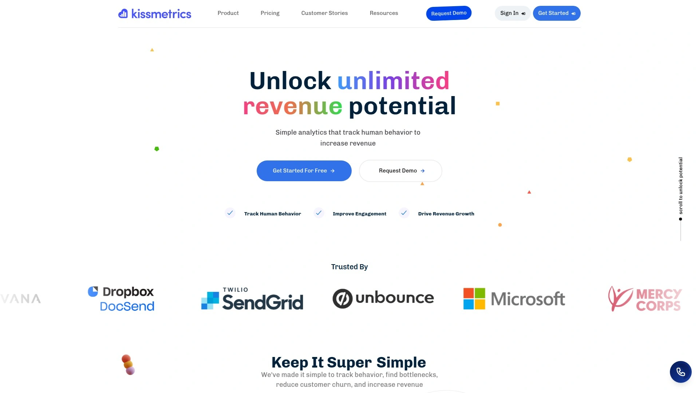

This platform transforms how businesses analyze customer behavior by focusing on people rather than anonymous pageviews. Every action ties to an individual user profile, letting you track their complete journey from first visit through multiple purchases. Funnel and cohort analyses provide insights into exactly where customers drop off and why certain groups convert better than others.

The interface feels intuitive even for non-technical users. Charts and visualizations translate complex data into understandable patterns without requiring analytics expertise. Integration capabilities connect with marketing platforms like Mailchimp and Google Analytics, centralizing data from multiple sources. A/B testing tools let you compare strategies and see how changes impact actual customer behavior, not just arbitrary metrics.

Retention tracking becomes actionable rather than observational. The system identifies specific factors contributing to loyalty or churn, giving you concrete steps to improve rather than vague directional guidance. Customer journey mapping shows the exact path users take from acquisition to conversion, highlighting which touchpoints matter most.

Support teams respond quickly when issues arise. Users consistently mention helpful onboarding that gets them extracting value within days rather than weeks. For businesses prioritizing customer lifetime value over vanity metrics, this platform delivers the depth needed to actually improve retention.

## **[Mixpanel](https://mixpanel.com)**

Event-based analytics with real-time data processing.

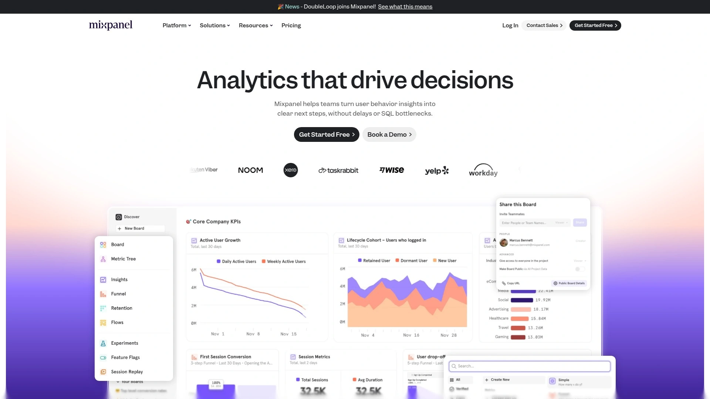

Founded to help product teams measure engagement properly, Mixpanel tracks every user interaction as discrete events. This granular approach reveals how different features drive activation, what actions correlate with retention, and which user segments generate the most value. Real-time processing means you see behavioral changes immediately after launches or campaigns.

Four core report types structure analysis. Insights reports segment users and filter events to answer questions about retention drivers and campaign effectiveness. Funnels visualize conversion paths to identify drop-off points. Flows show the actual paths users take through your product. Retention reports track how many users return after specific actions.

Event properties go beyond basic tracking to capture context—not just that someone clicked a button, but which page they were on, what conditions existed, and what actions followed. This depth enables pattern recognition that simpler tools miss entirely. Cross-event comparisons reveal how early behaviors influence later outcomes.

Custom dashboards consolidate the metrics that matter to your business. Integration with development tools via SDKs and APIs makes implementation straightforward for technical teams. User profiles aggregate demographics, behaviors, and preferences into comprehensive views of individual customers. The learning curve exists but pays off through sophisticated analysis capabilities.

## **[Amplitude](https://amplitude.com)**

AI-powered platform engineered for product teams.

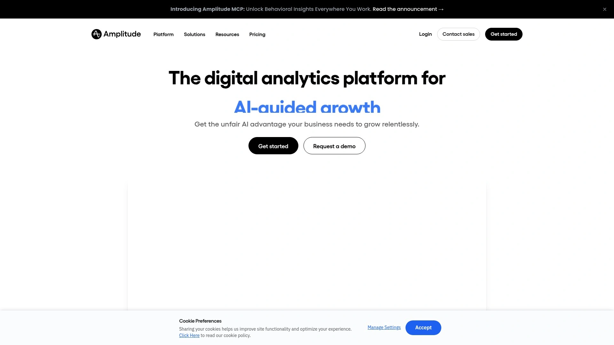

Over 5,000 companies including PayPal, Microsoft, Shopify, and Twitter use Amplitude to understand customer behavior. The platform emphasizes predicting which behaviors lead to retention and conversion, then providing guidance to drive those outcomes. Real-time analytics cover retention, revenue analysis, funnels, and user segmentation.

Event segmentation shows how customers interact with products over time, revealing frequency patterns and identifying which users trigger specific events. Retention analysis calculates return rates by measuring time between initial actions and subsequent engagements. Cohort creation groups users by shared characteristics like location, platform, or behavioral patterns for targeted analysis.

AI agents work continuously to spot optimization opportunities and build improvements around the clock. Session replay lets you watch exactly what users do, connecting qualitative observations to quantitative metrics. Feature experimentation tools test targeted releases to prove innovations work before full deployment.

Web experimentation deploys A/B tests and personalized experiences easily. Data governance maintains clean, accurate information with controls and guardrails. The platform integrates with existing marketing stacks to activate behavioral data wherever needed. Technical sophistication comes standard—the platform handles complex analysis at scale better than simpler alternatives.

## **[Heap](https://www.heap.io)**

Automatic data capture without manual event tracking.

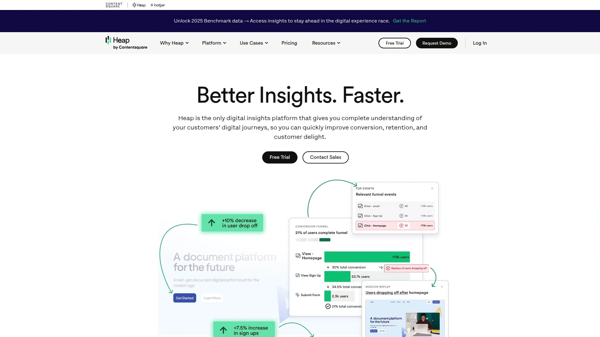

Heap stands out by recording every user action automatically from the moment you install it. No need to predefine events or configure tracking for individual interactions. This retroactive analysis capability means you can examine user behavior from day one, even for actions you didn't know you'd need to track.

A single code snippet captures the complete digital experience across all platforms. The system tracks clicks, taps, page views, form submissions, hovers, downloads, screen views, and more. User properties like demographics and device type enrich behavioral data. Conversion and acquisition tracking shows traffic sources and their effectiveness.

Journey analysis visualizes all paths users take through the customer experience. Advanced data science alerts you to friction points and opportunities you haven't been actively monitoring. This capability uncovers hidden insights that lead to significant business results.

Over 10,000 companies rely on Heap to understand end-to-end customer journeys. The platform improves conversion rates, boosts activation, increases retention, and enhances overall user experience. Real-time tracking provides immediate visibility into visitor activity, particularly valuable after UI changes or campaign launches. The automatic capture saves enormous time compared to manually configuring tracking for every user action.

## **[Google Analytics](https://analytics.google.com)**

Free comprehensive platform with massive ecosystem integration.

Google Analytics remains the default choice for most websites due to zero cost and deep integration with other Google products. GA4 provides real-time traffic updates, user activity dashboards, and extensive metrics around time on page, bounce rate, scroll depth, and content performance. The platform monitors sudden traffic changes automatically, alerting you to react quickly.

Audience demographics reveal visitor interests, locations, and behaviors for proper segmentation. Conversion tracking shows how often interactions lead to desired outcomes. E-commerce tracking monitors transactions and shopping behaviors. Custom reports and dashboards focus on your specific KPIs, though setup involves a learning curve.

The Explore feature filters data by segments, dimensions, and metrics to remove noise and clarify what matters. Analytics Intelligence answers natural language questions with clear responses and key metrics, helpful for beginners. Integration with AdWords, Tag Manager, and Data Studio broadens analytical scope significantly.

Universal accessibility makes it standard across organizations of all sizes. However, the interface can feel overwhelming initially, and some users express privacy concerns about granting Google full access to website data. Despite these tradeoffs, the comprehensive feature set at zero cost keeps it dominant.

## **[Hotjar](https://www.hotjar.com)**

Visual behavior analytics through heatmaps and session recordings.

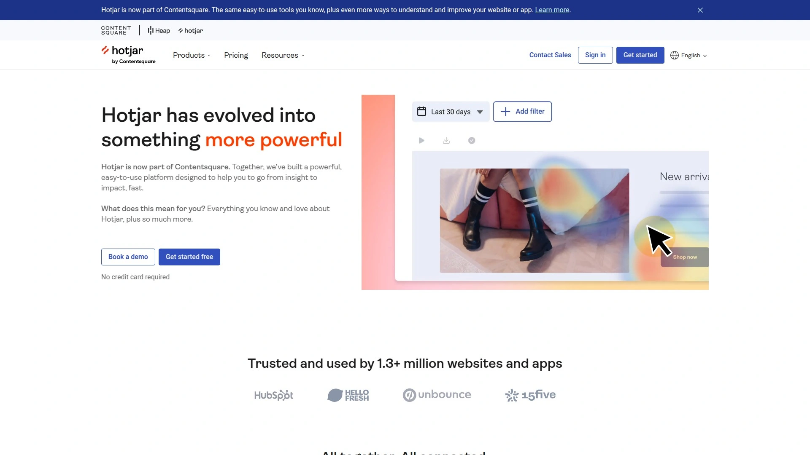

Now part of Contentsquare alongside Heap, Hotjar specializes in visual understanding of user behavior. Heatmaps show where visitors click, scroll, and hover, revealing which elements engage users and which get ignored. Session recordings capture individual user journeys, letting you watch how people navigate your site and where they encounter friction.

The tracking code installation starts data collection on clicks, scrolls, mouse movements, and all user actions. Visual representation makes complex data accessible to non-analysts. Surveys and feedback widgets gather qualitative insights to complement quantitative metrics. This combination provides both what users do and why they do it.

Trusted by 1.1 million websites across 180+ countries. The platform complements traditional analytics like Google Analytics by adding visual context to numerical data. Identifying usability issues becomes straightforward when you can literally watch users struggle. Form analytics reveal where people abandon registrations or checkouts.

The basic plan offers limited functionality, pushing most businesses toward paid upgrades as they scale. Some features carry a learning curve despite the user-friendly interface. Guides, tips, and tutorials help overcome these challenges. For UX teams needing to see user behavior rather than just count it, Hotjar delivers essential visibility.

## **[Pendo](https://www.pendo.io)**

Product experience platform combining analytics and in-app guidance.

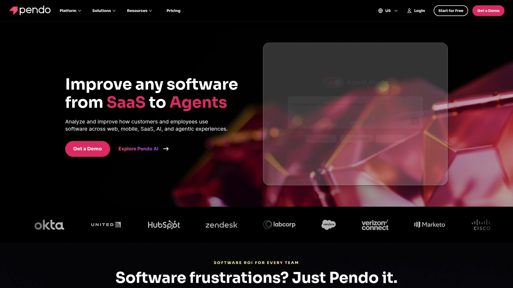

Pendo integrates product analytics with in-app messaging and user feedback collection. Event tracking captures user interactions with reduced developer involvement through tag-based setup. Funnel and path analysis visualize journeys to identify drop-offs and optimize conversions. Retention analysis tracks behavior over time to understand loyalty and churn.

Session replay provides visual recordings of user interactions for identifying UI bottlenecks. A/B testing through the experiments feature compares different messaging or design approaches. AI-powered customer intelligence automates data analysis, detects anomalies, predicts trends, and generates recommendations.

Customizable dashboards combine metrics, reports, and visualizations. Feature adoption reports show which capabilities drive engagement. Product areas help organize analytics and monitor growth across different sections. Time-to-first-use metrics reveal how quickly users engage with features.

Out-of-the-box functionality requires minimal configuration, letting teams gain insights quickly without extensive setup. Segmentation and targeting enable personalized messaging to specific user groups. The comprehensive feature set covers most product analytics needs in one platform. Users report occasional data discrepancies and complexity in the interface as drawbacks. Pricing feels unjustified to some customers relative to value received.

## **[Segment](https://segment.com)**

Customer data platform that centralizes information from all sources.

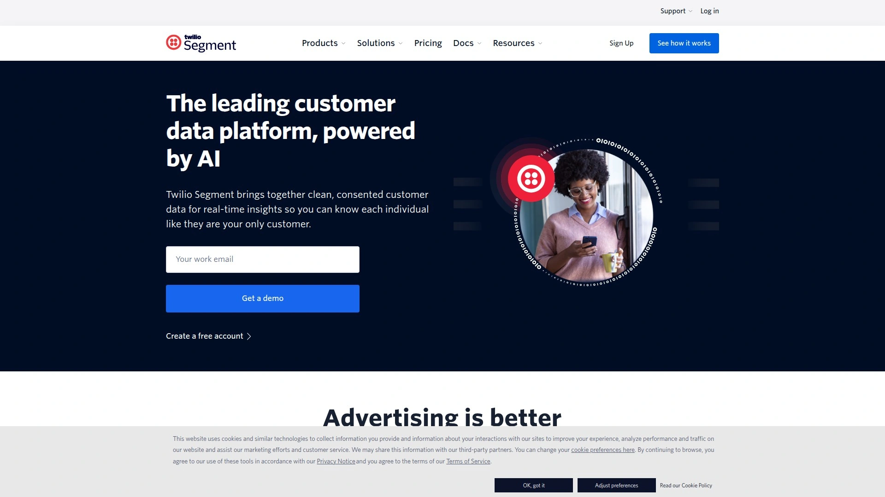

Segment acts as the hub connecting every platform your business uses—analytics, CRM, marketing automation, product development, and sales. Data flows bidirectionally, letting you push website visit information from your CMS into your CRM automatically. This creates a single source of truth accessible across all business units.

The Connections product pulls data from defined sources into a central repository, then sends it to specified destinations using a single API. Native integrations cover Salesforce, Facebook Ads, and hundreds of other tools. Custom sources and destinations accommodate unique business requirements.

Data standardization ensures all teams work from consistent information. The unified customer view amalgamates online and offline datasets, enabling deeper analysis and enhanced marketing capability. Confidence in data accuracy and completeness improves, making insights more reliable.

GDPR compliance includes a Privacy Portal for managing personally identifiable information. Data deletion requests from users can be processed within Segment and forwarded to connected platforms. Unlike data management platforms focused on anonymous third-party data, Segment emphasizes first-party customer data you already own.

Thousands of innovative brands including IBM, Peloton, Intuit, and Instacart use Segment for digital transformation. The platform eliminates multiple custom integrations by providing one API for all data movement.

## **[Matomo](https://matomo.org)**

Privacy-focused analytics with full data ownership.

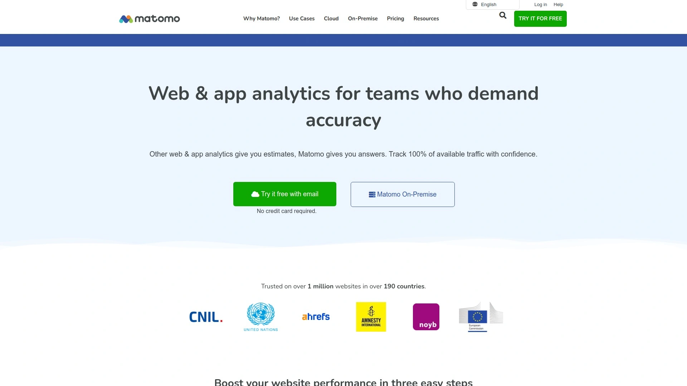

Matomo positions itself as the ethical alternative to tools that share data with big tech companies. Self-hosting options give you complete control over customer information. The platform tracks similar metrics to Google Analytics—traffic sources, user behavior, conversions, and engagement.

No external company accesses your data. This privacy-first approach appeals to organizations with strict compliance requirements or philosophical opposition to data sharing. GDPR, CCPA, and other privacy regulations are easier to satisfy when you control storage and access.

Feature parity with mainstream analytics tools means you don't sacrifice capabilities for privacy. Heatmaps, session recordings, funnel analysis, and A/B testing come standard. Custom dimensions and events let you track business-specific metrics.

Cloud-hosted and self-hosted options accommodate different technical capabilities and preferences. The open-source foundation means transparency into how the platform works. Community contributions and plugins extend functionality beyond core features. For privacy-conscious organizations or those operating in regulated industries, Matomo delivers professional analytics without compromising data sovereignty.

## **[Woopra](https://www.woopra.com)**

Real-time customer journey analytics across touchpoints.

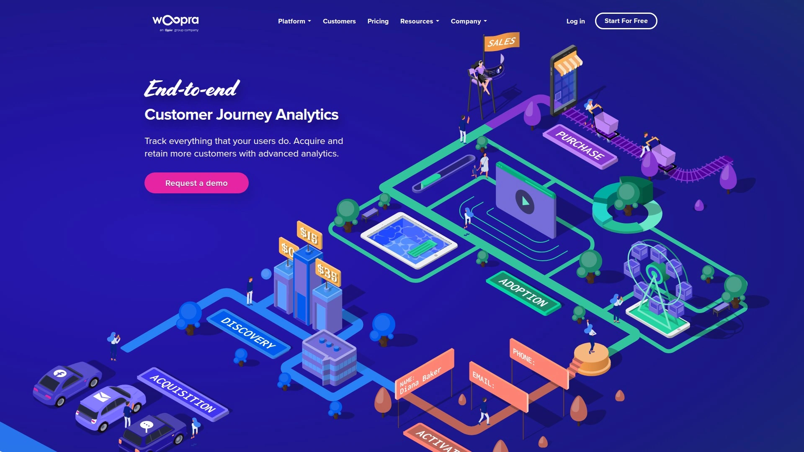

Woopra organizes analytics around touchpoints like live chat interactions and post-onboarding email behaviors. This structure makes connecting data across multiple properties and platforms straightforward. Customer profiles aggregate all activities into unified views.

Funnels, retention analytics, and segmentation reveal user behavior, engagement, and conversion paths. The platform watches customers navigate their entire journey through data-driven analysis. Live tracking shows exactly what visitors are doing in real time, including traffic sources and current pages.

Integration with sales tools includes live chat, team inbox, and built-in CRM. This sales support makes Woopra valuable beyond pure analytics. Engaging with website visitors becomes possible the moment they show interest.

Plans start at $999 monthly for professional features, with a free tier covering up to 500,000 actions. The pricing reflects enterprise positioning rather than small business targeting. For companies needing sophisticated customer journey mapping with real-time visibility, the investment delivers comprehensive insights.

## **[Smartlook](https://www.smartlook.com)**

User behavior recording for websites, mobile apps, and games.

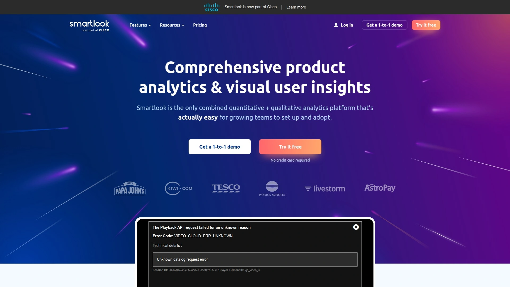

Smartlook records visitor sessions across digital properties to provide visual insights into behavior. Session recordings replay visitor journeys, highlighting clicks, taps, and navigation paths. Heatmaps complement recordings with aggregate views of where users interact most.

Event tracking monitors specific actions without requiring extensive configuration. The visual approach helps identify usability issues that numerical analytics miss. Optimization opportunities become obvious when you can watch multiple users struggle with the same element.

Mobile app and game support extends beyond typical website-focused tools. Understanding behavior across platforms from one interface simplifies analysis for multi-channel businesses. Data-driven decision making improves when you can see problems rather than just inferring them from metrics.

A free plan offers basic functionality for testing. Pro plans start at €55 monthly, making it accessible for small to medium businesses. For teams needing visual confirmation of what analytics suggest, Smartlook bridges the gap between numbers and actual user experience.

## **[Fullstory](https://www.fullstory.com)**

Enterprise-grade digital experience analytics and session replay.

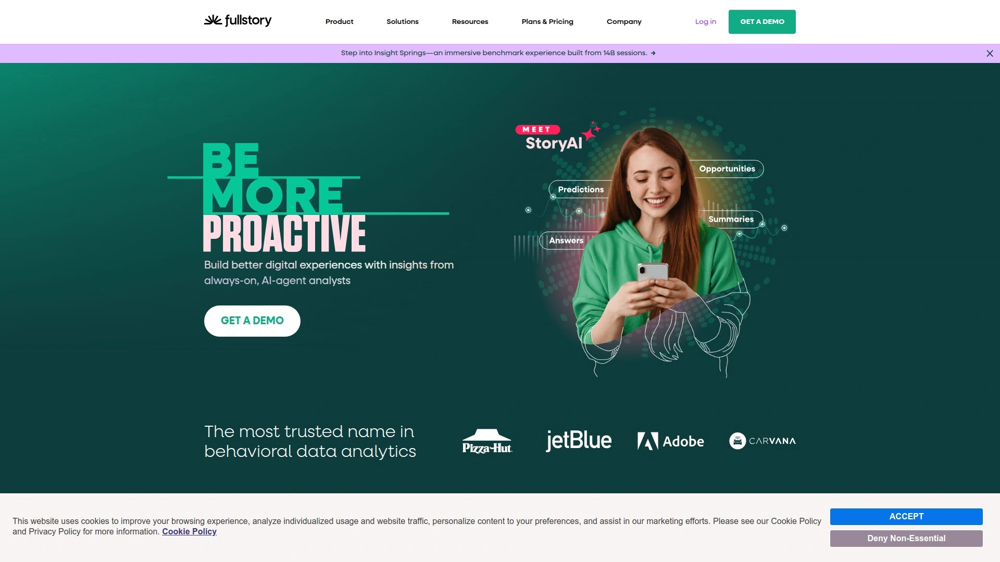

Fullstory captures complete digital experiences automatically, similar to Heap's approach. The platform combines quantitative metrics with qualitative session replay to understand both what happens and why. Behavioral data captures every interaction for analysis and optimization.

Enterprise clients trust Fullstory for sophisticated analysis capabilities. The platform identifies moments of friction and opportunity in digital experiences. Funnel analysis shows exactly where users abandon processes. Segment-based analysis reveals how different user groups behave.

Privacy controls ensure compliance with data protection regulations. Redaction capabilities automatically hide sensitive information in recordings. Flexible deployment options accommodate various technical architectures.

Integration with development and product management tools connects insights to action. Technical teams can diagnose bugs by watching how they manifest in real user sessions. Product managers validate design decisions through behavioral evidence. For large organizations needing comprehensive digital experience insights, Fullstory provides enterprise-grade capabilities.

## How do behavior analytics platforms differ from traditional web analytics?

Traditional tools count pageviews and track aggregate traffic patterns, treating each visit as independent. Behavior analytics platforms connect actions to individual users across sessions, revealing complete customer journeys. This person-based tracking shows which features drive conversions, what paths successful customers take, and where friction causes abandonment. The shift from anonymous metrics to identified user tracking enables cohort analysis, retention measurement, and lifecycle optimization that aggregate data simply cannot support.

## Can these platforms integrate with existing marketing tools?

Modern analytics platforms prioritize integration through APIs, SDKs, and native connections. Kissmetrics links with Mailchimp and Google Analytics seamlessly. Mixpanel provides SDKs for web, mobile, and server-side implementation. Segment specializes in connecting hundreds of tools through a single API. Check documentation before committing—some integrations require paid tiers or custom development. The strongest platforms treat integration as core functionality rather than an afterthought.

## What metrics should I prioritize when evaluating these platforms?

Focus on retention cohorts, funnel conversion rates, and time-to-value measurements rather than vanity metrics like total pageviews. Retention analysis reveals whether customers stick around after onboarding. Funnel tracking identifies exact drop-off points in conversion processes. Cohort analysis shows how different user groups perform over time. Platforms that emphasize these behavioral metrics over simple traffic counts deliver actionable insights that actually improve business outcomes.

## Conclusion

Counting visitors stopped being useful the moment businesses realized conversion depends on behavior, not traffic volume. Modern analytics reveal why customers buy, which features create loyalty, and where friction kills revenue. [Kissmetrics](https://www.kissmetrics.io) leads this shift by tracking people instead of sessions, connecting every action to individual profiles that show complete customer journeys from first visit through repeat purchases. The funnel and cohort analyses don't just report what happened—they expose exactly where to focus improvement efforts for maximum impact. For teams done guessing and ready to optimize based on actual user behavior, this platform transforms analytics from reporting tool to growth engine.
